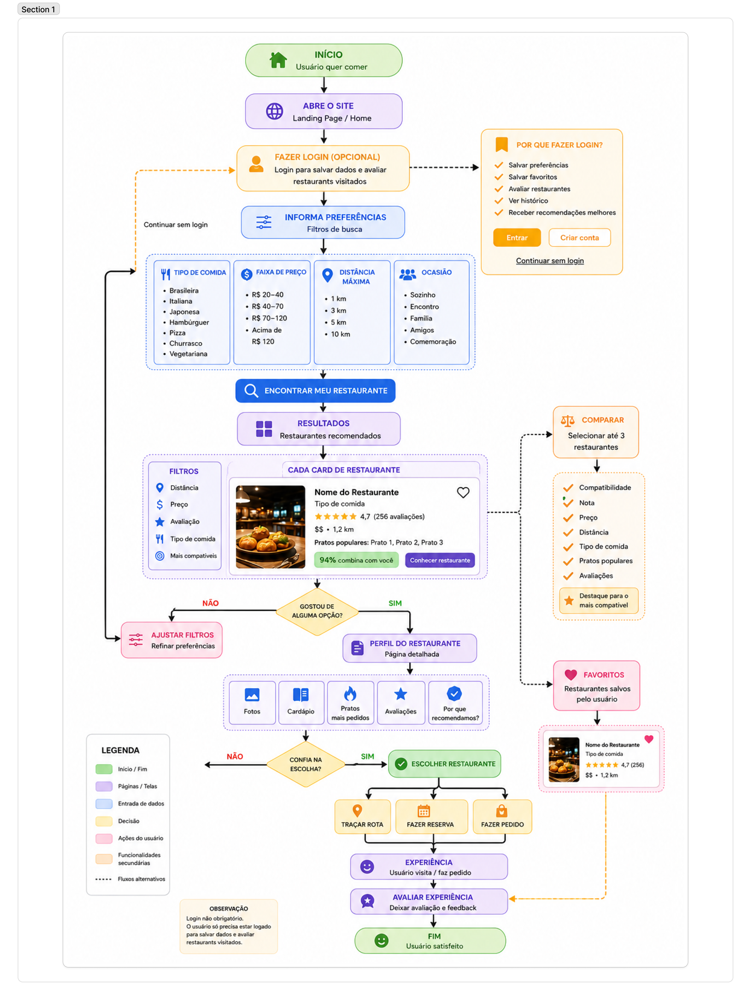
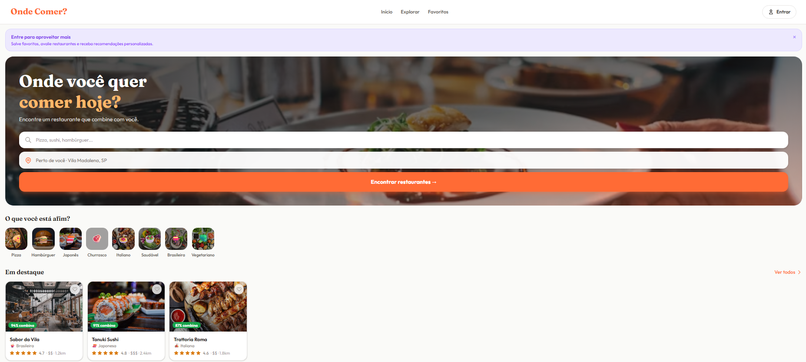
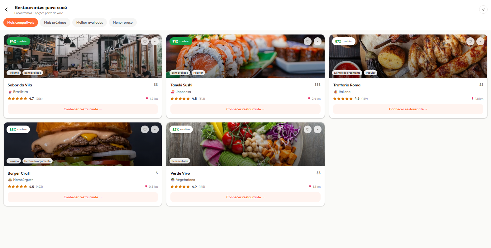
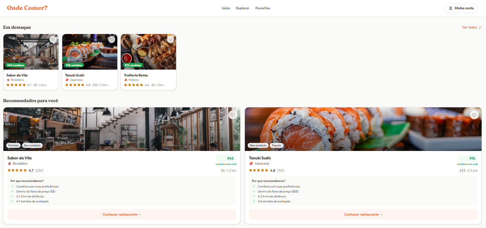

## Sobre o projeto

Este projeto consiste no desenvolvimento de uma aplicação voltada à recomendação e descoberta de restaurantes, com o objetivo de auxiliar o usuário durante o processo de escolha de onde realizar sua refeição.

A aplicação foi desenvolvida com foco em **experiência do usuário (UX)** e **interface do usuário (UI)**, buscando proporcionar uma navegação simples, intuitiva e eficiente. A proposta considera as necessidades do usuário durante a busca por um restaurante, organizando as informações de maneira clara e facilitando a tomada de decisão.

---

## Problema

A escolha de um restaurante pode se tornar uma tarefa difícil diante da grande quantidade de opções disponíveis. O usuário pode encontrar dificuldades para identificar rapidamente estabelecimentos que correspondam às suas preferências, localização, tipo de comida ou outras características relevantes.

Além disso, a quantidade de informações disponíveis pode tornar o processo de pesquisa demorado e dificultar a tomada de decisão.

Diante desse cenário, identificou-se a necessidade de uma solução que torne a busca e a escolha de restaurantes mais simples, organizada e eficiente.

---

## Solução proposta

A solução proposta consiste em uma aplicação que auxilia o usuário na escolha de restaurantes por meio de uma experiência de navegação intuitiva e organizada.

A aplicação tem como objetivo apresentar opções de restaurantes de forma clara, permitindo que o usuário explore diferentes estabelecimentos e encontre uma alternativa que esteja de acordo com suas preferências.

O desenvolvimento da interface prioriza princípios de design de experiência, como organização das informações, facilidade de navegação, clareza visual e redução da complexidade durante o processo de escolha.

---

## Telas desenvolvidas

As telas desenvolvidas representam o fluxo de interação proposto para a aplicação, desde a navegação inicial até a visualização das opções de restaurantes.

# fluxograma

## tela inicial

# tela de explorar

# restaurantes em destaques e recomendados

---

## Projeto no Figma

O protótipo e as interfaces desenvolvidas podem ser acessados por meio do seguinte link:

https://www.figma.com/make/S8PdVbvmg9CPCl6l5I8sSO/Create-a-website?t=nFTOnxeTMRMYGDCA-20&fullscreen=1

---

## Equipe

**Integrantes:**

- Fauze Maluf Neto
- Matheus de Carvalho Nunes
- Arthur Luis Freitas Milhomem
- João gabriel Gaspas dos Santos
